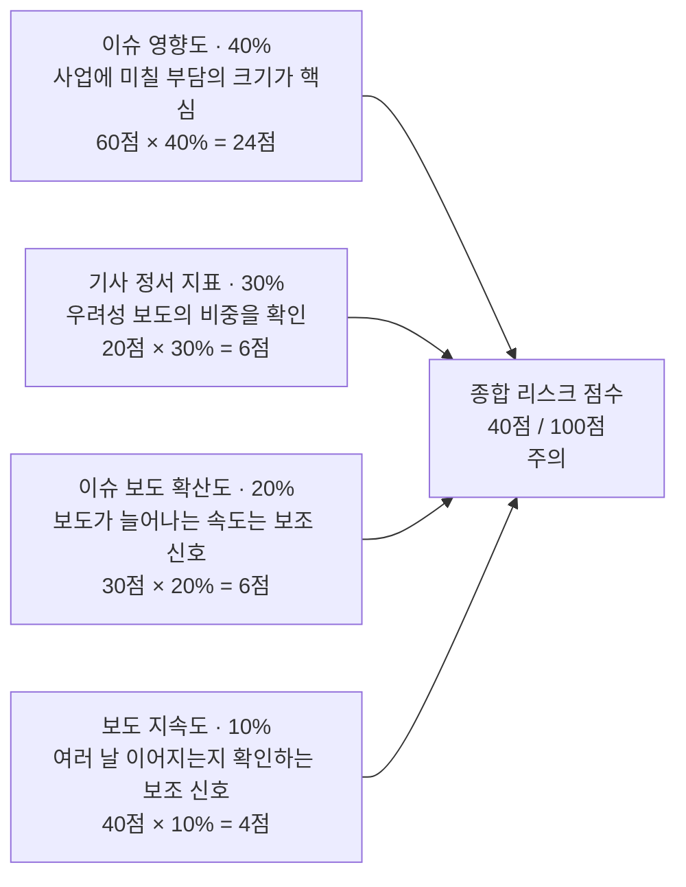

# 종합 리스크 점수 — 최종 발표용 설명 자료

> 아래 숫자는 계산 방식을 보여주기 위한 **가상 예시**입니다. 실제 기업의 분석 결과가 아닙니다. 현재 산식 버전: 2.3.0.

## 슬라이드에 넣을 핵심 그림

**최종 점수 = 반올림(이슈 영향도 × 0.40 + 기사 정서 지표 × 0.30 + 이슈 보도 확산도 × 0.20 + 보도 지속도 × 0.10)**

위 예시에서는 `24 + 6 + 6 + 4 = 40점`이므로 **주의** 단계입니다. 모든 지표는 0~100점이며, 종합 점수가 높을수록 뉴스에서 포착된 위험 신호가 강하다는 뜻입니다.

**가중치의 핵심 원칙:** “영향의 크기”를 가장 중요하게 보고, “기사의 분위기”로 교차 확인하며, “보도의 증가와 지속”은 보조 신호로 사용합니다. **40·30·20·10%는 이 원칙에 따라 정한 서비스 설계값**입니다. 과거 손실 자료를 학습해 도출한 최적 비율이나 통계적으로 검증된 위험 확률은 아닙니다.

## 지표별로 이렇게 설명하세요

| 화면에 표시되는 이름 | 관객에게 들려줄 설명 | 실제 산출 방식 | 반영 비율 | 왜 이 비율인가? |
| --- | --- | --- | ---: | --- |
| 이슈 영향도 | “최근 보도된 이슈가 이 기업의 사업에 부담을 줄 가능성이 얼마나 큰지 봅니다.” | AI가 최근 기사와 기업 맥락을 보고 **잠재적인 부정적 사업 영향**을 0~100점으로 평가합니다. 긍정적 기회 자체는 이 점수를 높이지 않습니다. | 40% | 기사가 많아도 사업 영향이 작을 수 있으므로, **영향의 크기**를 가장 중요한 판단 기준으로 둡니다. |
| 기사 정서 지표 | “기사 중 우려를 담은 보도가 얼마나 많고, 분류 결과가 얼마나 확실한지 봅니다.” | 최근 기사 중 부정 기사 비율 × 해당 기사들의 평균 분류 신뢰도 × 표본 보정값 `기사 수/(기사 수+5)` × 100, 반올림 | 30% | 부정적 보도가 실제로 얼마나 차지하는지 확인하는 핵심 근거지만, 기사 분위기만으로 사업 피해를 단정할 수 없어 영향도보다 낮게 둡니다. |
| 이슈 보도 확산도 | “평소보다 관련 보도가 얼마나 늘었는지 보되, 우려성 보도 비율도 함께 고려합니다.” | 최근 30일 기사량·언론사 수를 그 전 60일의 월평균과 비교해 증가세를 계산하고, 부정 기사 비율을 반영합니다. 기사량 증가세 80%·언론사 증가세 20%입니다. | 20% | 갑자기 늘어난 보도는 주목할 신호지만, 보도량 자체가 피해 규모를 뜻하지는 않으므로 보조적으로 반영합니다. |
| 보도 지속도 | “우려성 보도가 하루에 몰렸는지, 여러 날에 걸쳐 이어졌는지 봅니다.” | 최근 30일에 부정 기사가 나온 **서로 다른 날짜 수 ÷ 15일 × 100**, 반올림. 15일 이상이면 100점입니다. 기사 건수를 그대로 세지 않습니다. | 10% | 여러 날 이어지는지 확인하는 보조 지표입니다. 같은 사안의 반복 보도일 수도 있어 가장 작은 비율로 반영합니다. |

감성 분석 요약의 ‘긍정·중립·부정 %’는 기사 분포입니다. 위 **기사 정서 지표**는 분류 신뢰도와 기사 수 보정까지 적용한 위험 점수이므로, 화면의 부정 기사 비율과 숫자가 다를 수 있습니다.

### 계산식을 더 자세히 물으면

- `기사 정서 지표 = 반올림(부정 기사 비율 × 부정 기사 평균 분류 신뢰도 × 기사 수/(기사 수+5) × 100)`
- `보도 지속도 = 반올림(최소(부정 기사가 나온 날짜 수/15, 1) × 100)`
- `이슈 보도 확산도 = 반올림([기사량 증가 점수 × 0.8 + 언론사 증가 점수 × 0.2] × 부정 기사 비율)`입니다. 기사량 증가 점수는 `log₂((최근 30일 기사 수+5)/(이전 60일 기사 수/2+5)) × 50`, 언론사 증가 점수는 `log₂((최근 30일 언론사 수+2)/(이전 60일 언론사 수/2+2)) × 50`을 각각 0~100으로 제한합니다. 중간의 증가 점수도 반올림한 뒤 마지막 식에 넣습니다.
- `이슈 영향도`는 고정된 건수 공식이 아니라 AI 평가값입니다. 따라서 AI가 참고한 기사와 설명을 함께 제시해야 해석할 수 있습니다.

## 약 1분 발표 대본

“이 화면은 최근 30일의 기업 관련 뉴스에서 포착된 위험 신호를 네 가지로 나누어 보여줍니다. 이슈 영향도는 사안이 실제 사업에 줄 수 있는 부담을 AI가 평가한 값입니다. 사업에 미칠 **영향의 크기**가 가장 중요하므로 40%를 반영했습니다. 기사 정서 지표는 우려성 기사 비율과 분류 신뢰도를 살피며 30%를 반영합니다. 다만 기사의 분위기만으로 피해를 단정할 수는 없습니다. 이슈 보도 확산도와 보도 지속도는 각각 보도가 평소보다 얼마나 늘었는지, 여러 날 이어졌는지를 봅니다. 보도량과 반복 보도가 곧 피해 규모는 아니어서 보조 신호로 20%, 10%를 반영했습니다. 네 점수에 이 비율을 곱해 더하고 반올림합니다. 예를 들어 60, 20, 30, 40점이면 24, 6, 6, 4점을 합친 40점으로 ‘주의’ 단계입니다. 이 가중치는 서비스의 설계 기준이며, 점수는 실제 손실이나 주가를 예측한 값이 아닙니다.”

## 질문이 나오면 덧붙일 내용

- **왜 40·30·20·10%인가요?** 영향의 크기 40% → 우려성 보도의 비중 30% → 보도 증가 20% → 보도 지속 10% 순으로, 피해와 직접 관련된 신호에 더 큰 비중을 주는 설계 선택입니다. 실측 데이터로 최적화되거나 투자 수익률을 예측하도록 검증된 비율이라고 주장하지 않습니다.
- **등급 경계는?** 0~24점 낮음, 25~49점 주의, 50~74점 높음, 75~100점 심각입니다.
- **기사나 과거 데이터가 부족하면?** 최근 30일의 분석 가능 기사 3건 미만이면 최종 점수를 내지 않습니다. 보도 확산도를 계산할 DB 이력이 없으면 해당 지표는 ‘자료 없음’으로 표시합니다. 결측 지표의 가중치를 다른 지표로 재분배하지 않으므로, 이때의 점수와 산출 범위를 함께 봐야 합니다.
- **100점은 무엇을 뜻하나요?** 실제 부도 확률이나 주가 하락 확률 100%가 아닙니다. 이 시스템이 정의한 뉴스 위험 신호의 상대적인 강도를 뜻합니다.

구현 근거: `backend/server/src/services/companyRiskAssessment.service.js`의 `SCORE_WEIGHTS`, `calculateRiskSignals`, `calculateWeightedRiskScore`, `getRiskLevel`.
